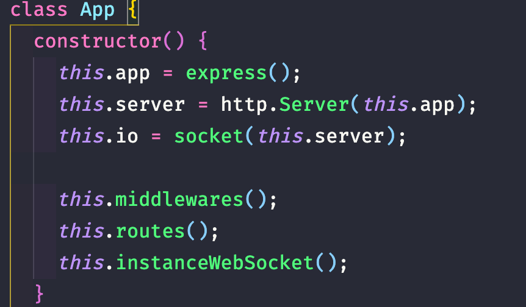

# Twitter Backend

Recriando a timeline do twitter utilizando Node | React | React Native

## Estrutura

A estrutura utilizada na aplicação se baseia no conceito MVC, e é utilizada os métodos de classes pois dá um ar semântico para o código.



## LIB's utilizadas

- cors
- dotenv
- express
- mongoose
- socket
- nodemon
- sucrase

## Considerações

Esta é uma aplicação real time. Para testar suas funcionalidades, disponibilizei um arquivo `rotas.json` que contém todas as rotas criadas na aplicação, para utilizá-la é necessário criar
um banco não relacional, e atribuir a URL ao arquivo `.env`.

**obs**: Eu utilizei o Banco MongoDB online: [Mongo Atlas](https://www.mongodb.com/)

## Teste o Socket

Existe uma rota na aplicação apontando para um arquivo `index.html` estático para testar a funcionalidade realtime sem a necessidade das demais aplicações, para acessa-la entre:

```
http://localhost:3333/io
```

Após, abra o console e teste alguma para que o console dispare alguma informação.

## Aplicações que utilizam este Backend

Este backend faz parte de um de um estudo e é utilizado nas seguintes aplicações:

- [Twitter Web | React.js](#!)
- [Twitter Mobile | React Native](#!)
